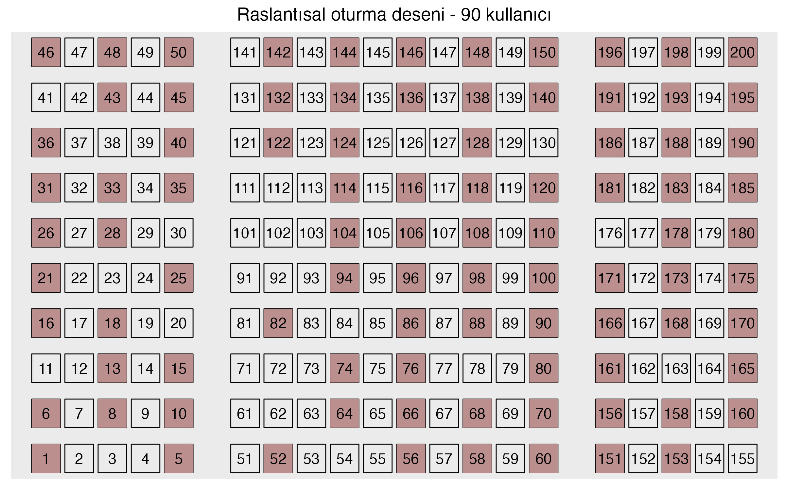

# seagap

Seagap, Milli Kütüphane okuma salonları için kullanıcılara arada bir boşluk bırakarak raslantısal masa numarası vermeyi önceleyen bir R programıdır.

Aşağıda 200 masalı temsili bir salonunda sırasıyla 90 ve 110 kullanıcının oturma desenleri yer alıyor. Şu kısa [blog yazısı](https://barisguven.netlify.app/posts/2025-01-30-milli-kutuphane-oneri/) bu programın neden ve nasıl yazıldığını açıklıyor.

